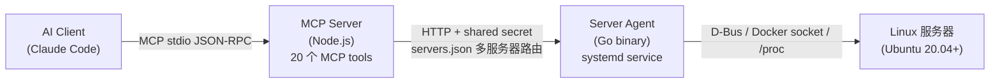

# AI Server Agent

让 AI Agent 安全地部署、管理和维护真实 Linux 服务器。

**AI 不直接操作 shell。** AI 通过 typed action 理解服务器状态、生成结构化计划、经风险评估后在受控沙箱中执行，所有操作可审计、可回滚。

## 架构



Agent 同时提供 Web Console（`GET /`），浏览器可直接访问仪表盘。

## 快速开始

### 1. 在目标服务器安装 Agent

```bash
curl -fsSL https://raw.githubusercontent.com/Ye-Yu-Mo/AI-SRE-Agent/main/agent/install.sh | sh
```

安装完成后终端会打印 `AGENT_SECRET`，复制备用。Agent 以 systemd service 运行在 `9090` 端口。

### 2. 本地安装 MCP Server

```bash
git clone https://github.com/Ye-Yu-Mo/AI-SRE-Agent.git
cd AI-SRE-Agent/mcp-server
npm install && npm run build
```

### 3. 配置 Claude Code

在项目根目录创建 `.mcp.json`：

```json
{
  "mcpServers": {
    "ai-server-agent": {
      "command": "/path/to/AI-SRE-Agent/mcp-server/run.sh",
      "args": [],
      "env": {
        "AGENT_ENDPOINT": "http://<服务器IP>:9090",
        "AGENT_SECRET": "<安装时打印的secret>"
      }
    }
  }
}
```

重启 Claude Code 即可使用。

## MCP Tools（22 个）

### 服务器管理
| Tool | 功能 |
|------|------|
| `server.list` | 列出已注册 Agent 服务器及在线状态 |
| `server.add` | 添加服务器到本地注册表（servers.json） |
| `server.remove` | 从注册表删除服务器 |

### 服务器状态（只读）
| `server.inspect` | CPU/Mem/Disk/OS/Kernel/Arch/Ports |
| `server.health` | 健康检查 + 告警列表 |
| `server.resources` | 详细资源数值（百分比） |
| `server.graph` | 应用/容器/端口/反向代理拓扑依赖图 |

### systemd 服务
| Tool | 功能 |
|------|------|
| `service.list` | 列出所有 systemd 服务及状态 |
| `service.logs` | journal 日志（最近 N 行） |
| `service.plan_restart` | 生成重启计划（不直接执行） |

### Docker 容器
| Tool | 功能 |
|------|------|
| `docker.list` | 列出所有容器及状态 |
| `docker.logs` | 容器日志（最近 N 行） |
| `docker.plan_restart` | 生成容器重启计划 |

### 执行 & 审计
| Tool | 功能 |
|------|------|
| `plan.apply` | 执行已审批的计划 |
| `command.run` | 执行 shell 命令（审批闸门 + 审计 + 脱敏） |
| `file.write` | 上传文件到 Agent 服务器 |
| `audit.search` | 查询操作审计日志 |

### 部署管理
| Tool | 功能 |
|------|------|
| `app.plan_deploy` | 生成部署计划（检测运行时、评估风险） |
| `app.apply_deploy` | 执行部署：clone → build → up → healthcheck → Caddy proxy → release。危险 compose 配置触发 409 风险卡片 |
| `app.status` | 查看应用状态、release 信息，含 `current_health` 实时健康探测（与历史 `healthcheck_status` 快照分离） |
| `app.rollback` | 回滚到上一版本，恢复 compose 快照 + 重建容器 |

### 故障诊断
| Tool | 功能 |
|------|------|
| `diagnose.website` | 诊断网站不可访问：端口监听 + HTTP 探测 + 容器状态 + 异常容器定位 |

## 安全原则

| 原则 | 实现 |
|------|------|
| 不暴露 root shell | AI 只能调用 typed action，不能执行任意命令 |
| Plan/Apply 分离 | 有副作用的操作先生成计划，审批后执行 |
| 风险分级 | typed action 硬编码分级：critical 直接拒绝，high 需显式审批 |
| 危险操作拒绝 | 停止生产数据库等不可逆操作判 critical，在 plan 创建阶段拦截 |
| Supply chain 拦截 | 部署前扫描 compose：privileged/docker.sock/root mount/host network 触发 409 |
| Secret 脱敏 | 日志输出自动掩码 PASSWORD/API_KEY/TOKEN，不返回明文 secret |
| 全量审计 | 每次写操作（含部署成功/失败）记录 before/after state |
| 部署可回滚 | 每次部署存 compose 快照，rollback 恢复完整配置不只是代码 |
| Agent 沙箱 | ProtectSystem=strict, NoNewPrivileges=true，Agent 不能自修改或提权 |

## Web Console

内置现代化仪表盘，浏览器访问 `http://<server>:9090/` 输入 Agent secret 即可查看：

- Tailwind CSS + Lucide Icons 设计，深色/浅色主题切换
- 中英文国际化
- CPU / Memory / Disk 实时仪表 + 进度条
- Docker 容器状态 + 端口映射
- 审计日志表格
- 版本号 + server_id
- Token 存在 sessionStorage，关标签页自动清除

## 多服务器

Server 列表存在 `mcp-server/servers.json`，无需在 `.mcp.json` 里拼环境变量：

```json
{
  "servers": [
    {"id": "prod-01", "endpoint": "http://1.2.3.4:9090", "secret": "sec1"},
    {"id": "prod-02", "endpoint": "http://5.6.7.8:9090", "secret": "sec2"}
  ]
}
```

也可通过 MCP tool 管理：
- `server.add("prod-03", "http://...", "secret")` — 添加新服务器
- `server.remove("prod-03")` — 删除服务器

重启 Claude Code 后生效。

## Agent 更新

每次 Release 由 GitHub Actions 自动构建 amd64/arm64 二进制。更新流程：

```bash
curl -fsSL https://github.com/Ye-Yu-Mo/AI-SRE-Agent/releases/latest/download/ai-server-agent \
  -o /usr/local/bin/ai-server-agent
chmod 755 /usr/local/bin/ai-server-agent
systemctl restart ai-server-agent
```

Agent 出于安全设计不能自更新（`ProtectSystem=strict`），必须由外部触发。

## 项目结构

```
├── agent/                  # Go Agent — 运行在目标服务器
│   ├── cmd/agent/          # 入口：ai-server-agent serve + Web Console
│   │   └── console/        # 嵌入式仪表盘 HTML
│   ├── internal/
│   │   ├── action/         # Typed Action 模型 + Plan 状态机
│   │   ├── collector/      # /proc、systemd、Docker 状态采集
│   │   ├── deploy/         # 部署流水线（proxy/compose/healthcheck/release/rollback）
│   │   ├── executor/       # Typed Executor
│   │   ├── graph/          # State Graph 拓扑采集
│   │   ├── identity/       # Server identity 生成
│   │   ├── plan/           # Plan 内存存储
│   │   ├── risk/           # 硬编码风险分级表
│   │   ├── secret/         # 日志脱敏
│   │   └── storage/        # JSON 文件持久化（audit + releases）
│   ├── install.sh          # 一行安装脚本
│   └── uninstall.sh        # 卸载脚本
├── mcp-server/             # MCP Server — AI 交互层
│   └── src/
│       ├── index.ts        # 18 个 MCP tool 注册
│       ├── client/agent.ts # Agent HTTP client（多服务器路由）
│       └── tools/server.ts # Tool handlers
├── .github/workflows/      # CI/CD：测试 + 跨平台构建 + Release发布
├── .mcp.json               # Claude Code MCP 配置示例
└── CHANGELOG.md
```

## 技术栈

| 组件 | 技术 |
|------|------|
| Agent | Go，单一静态二进制（~10MB），零外部运行时依赖 |
| MCP Server | TypeScript，@modelcontextprotocol/sdk |
| Web Console | 内嵌 HTML/CSS/JS，Go embed，Pico.css 风格 |
| 持久化 | JSON 文件（audit.jsonl + releases.jsonl） |
| 部署 | systemd service + Docker Compose v2 + Caddy 反向代理 |
| 传输 | HTTP + shared secret |
| CI/CD | GitHub Actions：vet → test → cross-compile → Release |
